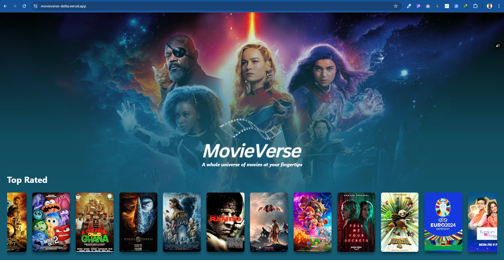
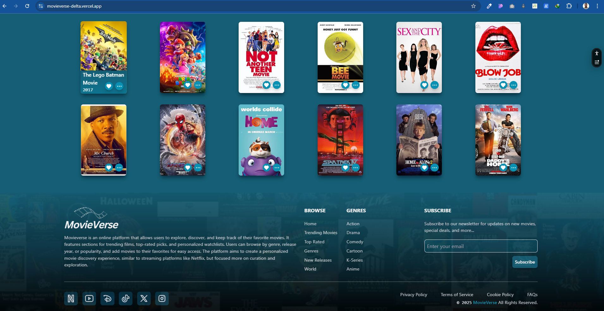

# 🎬 MovieVerse

**MovieVerse** is a modern web application that allows users to browse and discover movies, view details, and get recommendations. Built with **ReactJS** and **TailwindCSS**, the app provides a sleek and user-friendly interface for movie lovers.

## 🚀 FEATURES

- 🔍 **Search & Discover** – Find movies by title, genre, or trending releases.
- 🎭 **Detailed Movie Pages** – View movie descriptions, ratings, trailers, and cast information.
- 🌟 **User Ratings & Reviews** – Leave ratings and read community reviews (if implemented).
- 🎥 **Trending & Popular Movies** – Stay updated with the latest and most popular films.
- 📜 **Watchlist** – Save movies to your watchlist for later (if implemented).
- 🎨 **Modern UI/UX** – Designed with **ReactJS** and styled with **TailwindCSS** for a clean and responsive experience.

## 📷 Screenshots

  
_Home Page of MovieVerse_

  
_Favorites and Footer Section_

## 🛠️ TECH STACK

- **Frontend:** ReactJS, TailwindCSS
- **State Management:** React Context API
- **API:** OMDb API
- **Other Tools:** React Router, Unsplash

## 📦 Installation & Setup

1. **Clone the repository**
   ```sh
   git clone https://github.com/RemedyOnline/omdbMovieTopUp.git
   cd omdbMovieTopUp
   ```
